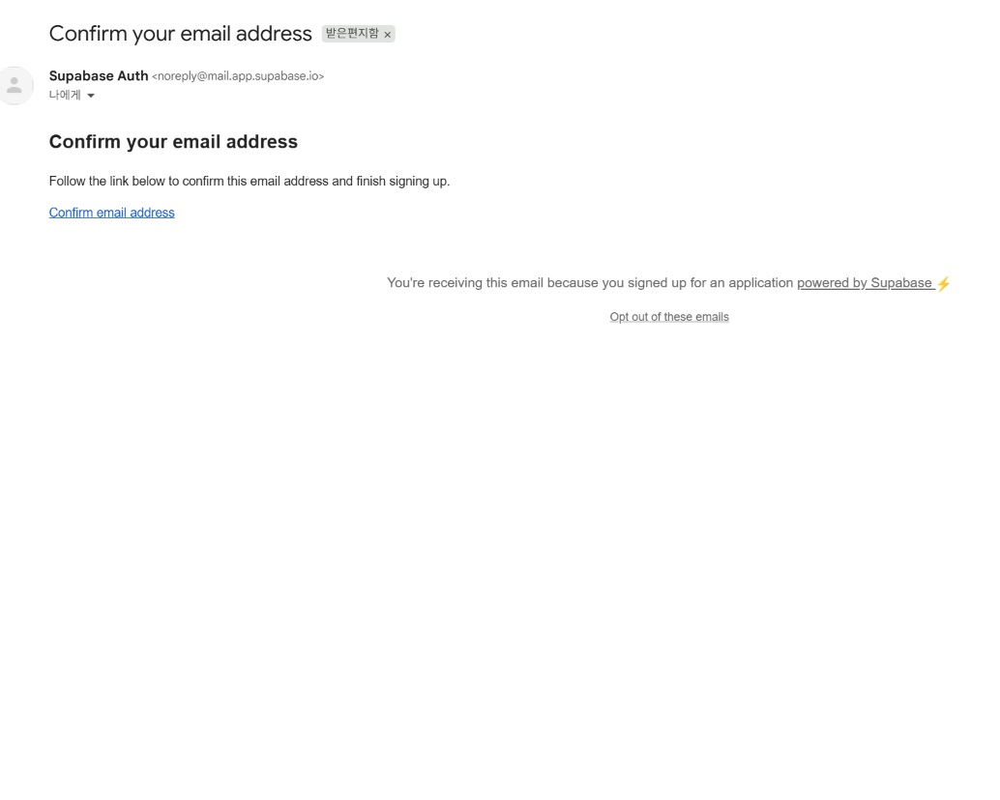
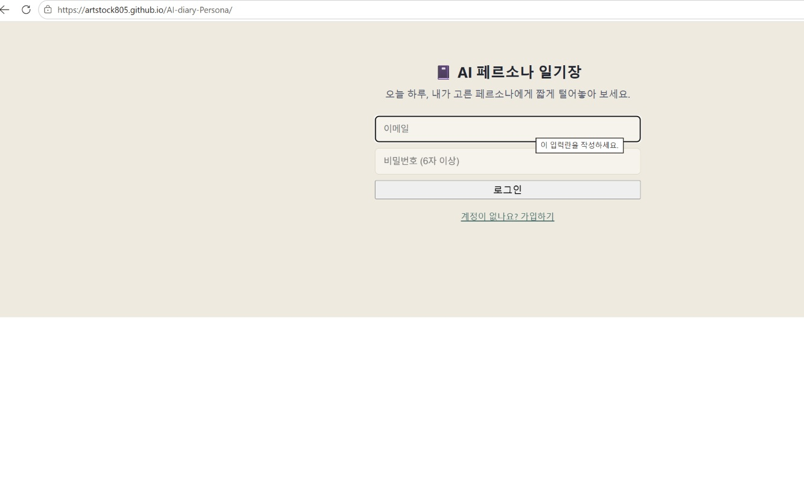
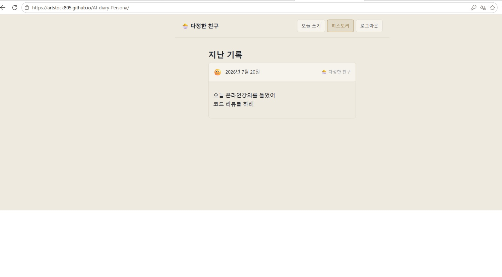
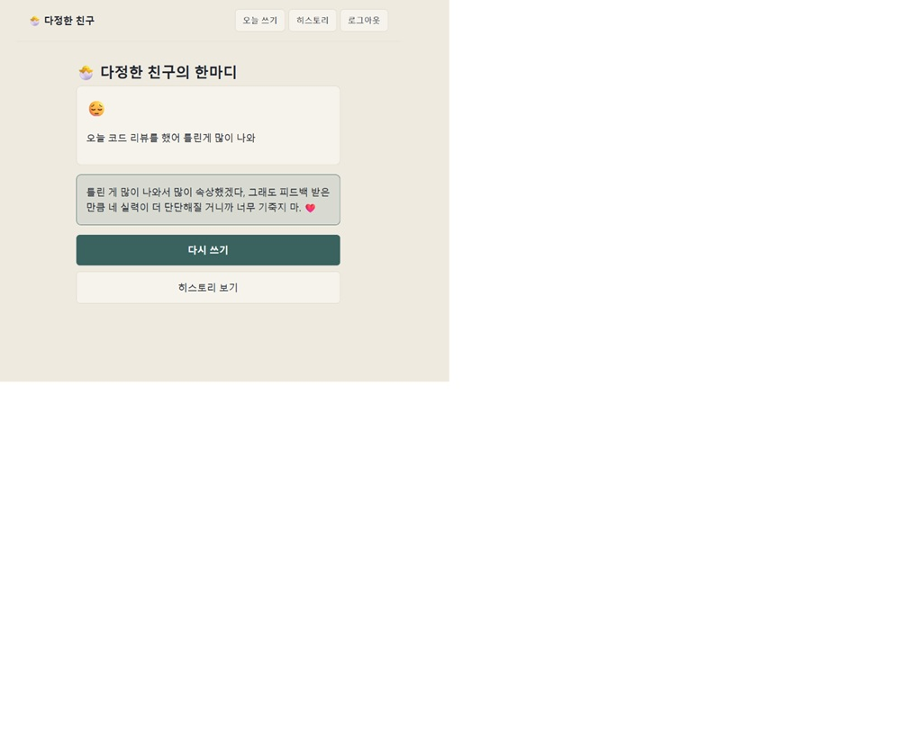

# AIFFEL Campus Code Peer Review Templete
- 코더 : 전세환 (GitHub: [artstock805](https://github.com/artstock805))
- 리뷰어 : 김만정 (GitHub: mjkimlunar)

- 리뷰 대상: https://github.com/artstock805/AI-diary-Persona (fork: https://github.com/mjkimlunar/AI-diary-Persona)
- 프로젝트 요약: React(Vite) + Supabase(Auth/DB/Edge Function) 기반 "AI 페르소나 일기장". 사용자가 오늘의 기분/일기를 쓰면, 고른 페르소나의 말투로 Gemini API가 코멘트를 생성해 저장한다.
- 스택: React 19 + Vite, Supabase JS client, Supabase Edge Function(Deno) → Google Gemini(최초 `gemini-2.0-flash` → 이후 `gemini-flash-latest`로 변경)

> 표기 규칙: 항목에 해당하면 `[O]`, 해당하지 않으면 `[X]`.

## 코더의 구두 설명 (리뷰 중 청취)

> "요즘 유행이라는 AI 페르소나" — 오늘의 감정을 고른 페르소나의 말투로 반응해주는 컨셉을 최근 트렌드에 착안해 기획했다는 설명.

이 설명은 프로젝트의 **기획 동기**를 설명하지만, 아래 2·3·4번 항목에서 요구하는 기술적 근거(모델 선정 이유, 디버깅 기록, 회고)는 다루지 않음 — 구두 설명만으로는 해당 항목들이 보완되지 않음.

---

# PRT(Peer Review Template)

**[O]  1. 주어진 문제를 해결하는 완성된 코드가 제출되었나요?**

- 핵심 플로우(가입/로그인 → 페르소나 선택 → 오늘 쓰기 → AI 코멘트 생성/저장 → 새로고침·재로그인 후 히스토리 유지)가 코드상 end-to-end로 연결되어 있음.
  - 인증: [`AuthScreen.jsx`](src/components/AuthScreen.jsx) — `supabase.auth.signInWithPassword` / `signUp`
  - 온보딩: [`Onboarding.jsx`](src/components/Onboarding.jsx) — `personas` 테이블 조회 후 선택값 로컬스토리지 캐시
  - 작성/저장: [`TodayWrite.jsx`](src/components/TodayWrite.jsx) — `diary_entries` insert 후 `diary-comment` Edge Function 호출
  - 결과 표시: [`CommentView.jsx`](src/components/CommentView.jsx)
  - 이력: [`History.jsx`](src/components/History.jsx) — RLS로 본인 데이터만 조회
  - DB/보안 정책: [`supabase/schema.sql`](supabase/schema.sql)
  - AI 코멘트 생성: [`supabase/functions/diary-comment/index.ts`](supabase/functions/diary-comment/index.ts)
- **실행 화면 근거**: 코더가 제공한 실행 캡처로 아래를 직접 확인함

  1. Supabase Auth 가입 확인 메일 정상 발송

     

  2. 배포 주소(`https://artstock805.github.io/AI-diary-Persona/`)에서 로그인 화면 정상 렌더링

     

  3. (수정 전) 히스토리 화면에서 "다정한 친구" 페르소나로 쓴 일기가 새로고침/재접속 후에도 유지 → 영속성 요구사항은 확인되지만, 이 시점엔 AI 코멘트가 비어있었음(PRT 3번 참고)

     

  4. (수정 후) 모델 별칭 수정(`dbad515`) 반영 후 다시 작성 → "다정한 친구"의 AI 코멘트가 정상적으로 생성되어 표시됨 — **AI 코멘트 누락 문제가 실제로 해결되었음을 실행으로 확인**

     

- 과제 요구조건 대비: README의 "이번 과제에서 바꾼/개선한 부분"(페르소나별 코멘트를 같은 일기 행에 저장)은 코드([`TodayWrite.jsx`](src/components/TodayWrite.jsx)에서 insert 후 같은 row update)와 실제로 일치함.

**[X]  2. 핵심적이거나 복잡하고 이해하기 어려운 부분에 작성된 설명을 보고 해당 코드가 잘 이해되었나요?**

- 근거: 소스 코드 전반에 주석/doc string/annotation이 거의 없음. 특히 아래처럼 이해에 설명이 필요한 부분에도 설명이 없음:
  - [`supabase/functions/diary-comment/index.ts`](supabase/functions/diary-comment/index.ts) — `Authorization` 헤더 존재만 확인하고 실제 검증은 RLS에 위임하는 설계인데, 왜 이렇게 짰는지 주석 없음. 코드만 보고는 "이게 의도한 설계인지 버그인지" 리뷰어가 판단해야 했음.
  - `gemini-flash-latest` 등 모델명을 고른 이유가 코드/README 어디에도 없음.
  - README가 언급한 "설계 문서: 사용자 흐름 / 데이터 모델 / 보안 체크리스트는 별도 설계 지도 참고"가 실제 저장소에는 없어 확인 불가.
- README의 설치/실행 절차 자체는 명확하지만, 이 항목이 요구하는 "코드 블록 단위 설명"과는 다른 종류의 문서라 이 항목 충족 근거로 보기 어려움.

**[X]  3. 에러가 난 부분을 디버깅하여 "문제를 해결한 기록"을 남겼나요? 또는 "새로운 시도 및 추가 실험"을 해봤나요?**

- 리뷰 과정에서 실제로 디버깅-수정 사이클이 있었고, 수정 후 재실행으로 해결까지 확인됨:
  1. 리뷰어가 실행 화면(히스토리)에서 AI 코멘트가 비어있는 것을 발견 (일기 내용만 있고 `ai_comment` 말풍선 없음, `screenshot1_ai_diary.jpg`)
  2. 코더에게 전달 → 코더가 원인을 파악해 [`supabase/functions/diary-comment/index.ts`](supabase/functions/diary-comment/index.ts)의 하드코딩된 모델명을 `gemini-2.0-flash`(만료/비활성 별칭으로 추정) → `gemini-flash-latest`로 수정, 커밋 `dbad515`로 반영함
  3. [`TodayWrite.jsx`](src/components/TodayWrite.jsx)가 Edge Function 에러 시 `ai_comment: null`로 조용히 넘어가는 구조라, 이 모델명 오류가 화면에는 아무 에러 없이 "코멘트만 비어있는" 형태로 나타났던 것으로 보임
  4. 수정 후 재실행 화면(`screenshot2_ai_diary.jpg`)에서 AI 코멘트가 정상적으로 생성되는 것을 확인 — 문제가 실제로 해결됨
- **다만 이 문제 해결 과정이 저장소 안에 기록되어 있지 않음** — 커밋 메시지("Gemini 모델을 최신 별칭으로 변경")만 있을 뿐, 무엇이 왜 실패했고 어떻게 원인을 찾았는지에 대한 기록(코드 주석, README, CHANGELOG, PR 설명 등 어디에도)이 없어 **X**로 판단함. 실제 디버깅은 있었으나 "기록을 남겼는가"라는 평가 기준은 충족하지 못함.
- 이 문제 해결 스토리 자체를 회고나 README에 짧게 남기는 것을 강력히 권장함(정확히 이 항목이 요구하는 내용).
- "새로운 시도 및 추가 실험" 관련해서도 과제 요구조건을 넘어선 별도 실험 기록은 발견되지 않음.

**[X]  4. 회고를 잘 작성했나요?**

- README/저장소 어디에도 회고(배운 점/아쉬운 점/느낀 점/어려웠던 점)가 없음. "이번 과제에서 바꾼/개선한 부분"이라는 한 줄짜리 변경사항 요약만 존재.
- 이 프로젝트는 커스텀 딥러닝 모델을 학습하는 과제가 아니라 기존 LLM API(Gemini)를 호출하는 구조라, "인풋→아웃풋 모델 아키텍처 도식화" 하위 기준은 해당 없음(N/A)으로 처리 — 대신 인증→온보딩→작성→코멘트→히스토리로 이어지는 화면/데이터 흐름도가 있으면 이해에 도움이 될 것.
- 회고에 포함되면 좋을 내용(위 3번과 연결): 왜 `Authorization` 헤더 존재만 확인하는 방식을 택했는지, CORS를 전체 허용으로 둔 이유, Gemini 모델명 이슈를 어떻게 찾아 고쳤는지.

**[O]  5. 코드가 간결하고 효율적인가요?**

- 이 프로젝트는 Python이 아닌 JS/JSX 기반이라 PEP8은 해당 없음 — 대신 JS 컨벤션·모듈화 기준으로 평가함.
- 컴포넌트가 단일 책임으로 잘 분리되어 있음: `AuthScreen`(인증) / `Onboarding`(페르소나 선택) / `TodayWrite`(작성) / `CommentView`(결과) / `History`(이력), Supabase 클라이언트도 [`lib/supabaseClient.js`](src/lib/supabaseClient.js) 하나로 싱글턴화되어 중복 없이 재사용됨.
- [`.oxlintrc.json`](.oxlintrc.json)으로 린트가 설정되어 있음(`react/rules-of-hooks` 등). 다만 규칙이 최소한(2개)이라 이 부분은 더 보강할 여지가 있음.
- 코드 중복은 눈에 띄지 않았고, 각 파일이 짧고 읽기 쉬움. Edge Function도 하나의 명확한 흐름(인증 헤더 확인 → entry 조회 → Gemini 호출 → row update)으로 간결하게 짜여 있음.

---

# 참고 링크 및 코드 개선

- **리뷰를 통해 실제로 개선된 코드**: 리뷰 중 발견한 "히스토리에 AI 코멘트가 안 보이는" 문제를 코더에게 전달 → 코더가 [`supabase/functions/diary-comment/index.ts`](supabase/functions/diary-comment/index.ts)의 Gemini 모델명을 `gemini-2.0-flash` → `gemini-flash-latest`로 수정(커밋 [`dbad515`](https://github.com/artstock805/AI-diary-Persona/commit/dbad51536820e310d6ad14db1dc4ea1397c49a2d))하여 반영함. 리뷰어가 fork를 upstream과 재동기화해 확인함.
- 코더가 같은 시점에 [`f9f5279`](https://github.com/artstock805/AI-diary-Persona/commit/f9f52793ee3da7f154991589709a55839c6d461f) 커밋으로 `.env.example`에 실제 Supabase anon key/URL을 채워 넣어, 별도 프로젝트 없이 바로 실행해볼 수 있게 개선함(anon key는 RLS로 보호되는 공개용 키라 안전).

---

# 부록: 프로젝트 제출 루브릭 평가

PRT와 별도로 안내된 프로젝트 제출 루브릭 기준 평가:

| 학습목표 | 평가기준 | 결과 | 근거 |
|---|---|---|---|
| 보안을 스스로 점검할 수 있습니다 | 제출물에 보안상의 문제가 없는지 잘 검토되어 있고, 실제로 문제가 없어야 한다 | **X** | RLS·서버사이드 키 분리 등 기본 조치는 되어 있으나, 아래 상세 근거의 미해결 이슈(Edge Function 토큰 검증 미흡, CORS 전체 허용, 에러 메시지 노출, rate limiting 부재)로 인해 "실제로 문제가 없어야 한다"는 기준을 충족하지 못함 |
| 실제 동작하는 백엔드 동작을 포함시킬 수 있습니다 | 실제로 동작하는 백엔드 동작이 의도한 것과 일치 | **O** | 인증·DB 영속성은 실행 화면으로 확인됨. AI 코멘트 누락 문제는 코더가 모델 별칭을 수정(`dbad515`)했고, 수정 후 재실행 화면(`screenshot2_ai_diary.jpg`)에서 AI 코멘트가 정상 생성되는 것까지 확인됨 |
| 프론트엔드와 백엔드가 적절하게 만들어져 동작합니다 | 서비스가 직관적이고, 의도한 대로 잘 동작 | **O** | 실행 화면으로 로그인/인증/히스토리 조회·영속성까지 확인됨 |

### "보안을 스스로 점검할 수 있습니다" 상세 근거

| 항목 | 결과 |
|---|---|
| RLS(행 단위 보안)가 모든 테이블에 걸려 있는가 | ✅ `personas`(인증 사용자 조회 허용), `diary_entries`(`auth.uid() = user_id`)로 select/insert/update/delete 모두 제한됨 ([schema.sql](supabase/schema.sql)) |
| API 키가 프론트에 노출되지 않는가 | ✅ Gemini 키는 Edge Function의 `Deno.env.get('GEMINI_API_KEY')`로만 사용, 프론트 코드/번들에는 전혀 없음. Supabase anon key는 공개되어도 되는 키이며 RLS로 방어되는 정상 패턴 |
| SQL 인젝션 여지 | ✅ 전부 Supabase JS 쿼리 빌더 사용, raw SQL 문자열 조립 없음 |
| 입력값 검증 | ⚠️ `content`는 클라이언트 `maxLength`와 DB `check` 제약(1000자)으로 이중 방어되어 있으나, `mood`는 DB 컬럼이 그냥 `text not null`이라 수정된 클라이언트나 직접 API 호출로 임의 문자열 삽입 가능 (제약 없음) |
| Edge Function 인증 검증 | ⚠️ `Authorization` 헤더의 **존재 여부만** 확인하고 실제 토큰 유효성은 검증하지 않음. 실질적 방어는 이 헤더를 그대로 Supabase 쿼리에 전달해 RLS가 걸러주는 방식에 전적으로 의존 |
| CORS 설정 | ⚠️ `Access-Control-Allow-Origin: '*'` — 모든 origin 허용 |
| 프롬프트 인젝션 노출면 | ⚠️ 사용자가 쓴 `content`/`mood`, DB에 저장된 `persona.tone_prompt`가 그대로 Gemini 프롬프트에 삽입됨. 영향은 제한적이나 악의적 입력으로 페르소나 지시를 무시시키는 것은 가능해 보임 |
| 에러 메시지 노출 | ⚠️ Gemini API 실패 시 `detail: await aiResponse.text()`를 그대로 클라이언트에 전달, Edge Function 최상위 catch도 `String(err)`을 그대로 반환 |
| Rate limiting | ❌ 없음 — `diary-comment` 반복 호출마다 Gemini API가 호출됨. `f9f5279`로 실제 anon key+프로젝트 URL이 커밋되어 누구나 클론 즉시 이 엔드포인트를 반복 호출 가능해져 악용 난이도가 낮아짐 |
| XSS | ✅ `dangerouslySetInnerHTML` 없이 JSX로만 렌더링되어 React 자동 이스케이프 적용됨 |

---

## 종합 의견

- 핵심 기능은 코드 수준에서 완결되어 있고 실행으로도 확인됐다(PRT 1번, 프론트-백엔드 통합) — 리뷰 중 발견된 AI 코멘트 누락 버그도 코더가 수정해 재실행 화면으로 해결 확인까지 마쳤다.
- 문서화(PRT 2번)와 디버깅 기록(PRT 3번), 회고(PRT 4번)가 공통적으로 약하다 — 특히 3번은 실제로 유의미한 디버깅(모델 별칭 버그 수정)이 있었던 만큼, 그 과정을 기록으로 남기지 않은 게 아쉽다.
- 코드 구조와 모듈화(PRT 5번)는 양호하다.
- 보안(제출 루브릭)은 RLS·키 분리 등 기본기는 있으나, 실제로 남은 이슈들 때문에 "문제가 없어야 한다"는 기준은 아직 충족하지 못한다 — 재제출 전 최우선 개선 권장.
